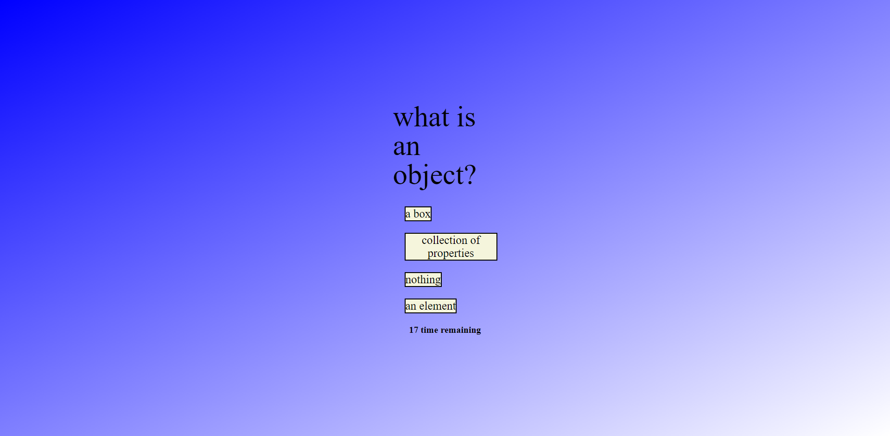

# Bielinski Quiz

## Description

My motivation for this project was to challenge myself and others on basic JavaScript knowledge. I built this project as a fun way to refresh myself on JavaScript definitions. It allows users to test their understanding on this subject. I learned a lot from this project. I learned how to utilize docs and stackoverflow. I learned about local storage and how to manipulate the html and CSS through JavaScript. This has been my most challenging project. 

## Installation

N/A

## Usage

In order to use the project, click the "JavaScript Quiz!" button to begin the game. Then click which answer you think is correct. Selecting the wrong answer will result in 3 seconds taken from your overall time. When the timer hits 0 or you go through all four questions, then the game will end. Then enter your name and hit "submit". You will be taken to the "High Score" Page, where hitting "clear" will remove names from the page. Hitting "return" will take you back to the game. 

https://lucasbielinski.github.io/bielinski-quiz/

## Credits
N/A

## License
N/A

## How to Contribute

For questions and contributions, you can reach me here:
[Email](mailto:bielinskilucas@gmail.com)
or
[Github](https://github.com/LucasBielinski)
